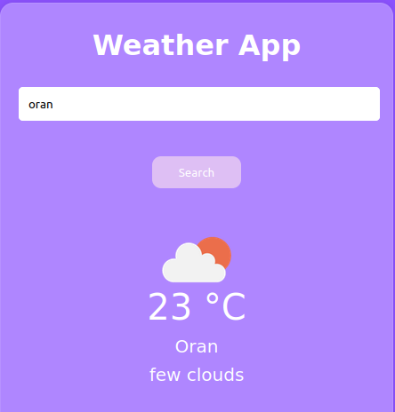

# Weather App 🌤️

A weather application that fetches and displays current weather data and an hourly forecast using the [OpenWeatherMap API](https://openweathermap.org/).  

## Features 🚀
- **Search Weather by City:** Enter a city name to display:
  - City name.
  - Current temperature.
  - Weather description.
  - Weather icon representing the condition (e.g., clouds, clear sky, rain).
- **Hourly Forecast:** View the next 8 hours of weather data, updated every 3 hours.


## Screenshots
### Current Weather
 <!-- Add a screenshot of the current weather display -->
### Hourly Forecast
 <!-- Add a screenshot of the hourly forecast display -->

## Technologies Used 🛠️
- **HTML5, CSS3, JavaScript:** For creating a responsive and interactive user interface.
- **OpenWeatherMap API:** To fetch real-time weather and forecast data.
- **Fetch API:** For handling API requests and responses.

## How It Works 🔍
1. User enters the name of a city in the search bar.
2. The app fetches weather data from the OpenWeatherMap API.
3. Displays:
   - Current weather data.
   - The next 8-hour forecast, with updates every 3 hours.
4. Updates the UI dynamically based on the fetched data.

## Installation and Usage 🖥️
1. Clone the repository:
   ```bash
   git clone git@github.com:sosmort/Weather-App.git
   cd Weather-App
2. Open the index.html file in a browser.
3. Create an account in OpenWeatherMap & replace YOUR_API_KEY in the JavaScript file with your OpenWeatherMap API key.

## Future Enhancements 🔮
- Add location-based weather updates using the Geolocation API.
- Improve error handling and user feedback for invalid city names.
- Style the app for better responsiveness and aesthetics.
- Display additional weather metrics (e.g., wind speed, humidity).

## Credits and Acknowledgments 🙌
- **Data provided by OpenWeatherMap API.**